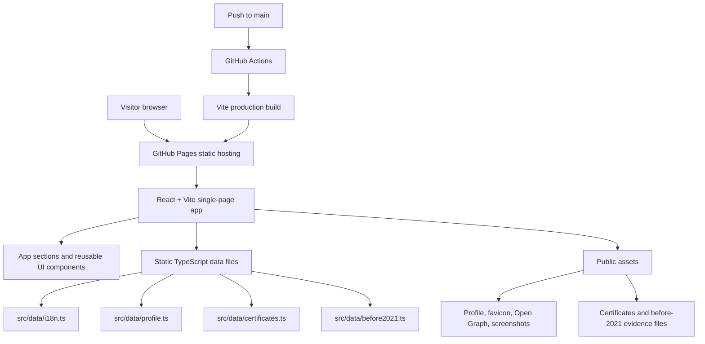

# Project Overview

## Purpose

This project is a professional portfolio website for **Jakapan Kanta**, a Senior Software Developer with 16+ years of experience across web, backend, mobile, healthcare, finance, and transportation systems.

The site is designed for interviewer presentation, resume sharing, professional networking, and GitHub Pages hosting.

## Audience

- Hiring managers
- Technical interviewers
- Engineering leaders
- Recruiters
- Professional network contacts

## Design Direction

The UI uses a corporate navy, blue, and cyan visual system with clean card-based sections, responsive layouts, subtle Framer Motion animation, and strong typography. The experience is mobile-first, supports light and dark themes, and keeps navigation clear on desktop and mobile screens.

The current Hero direction emphasizes enterprise delivery, cross-platform engineering, AI integration, AI-assisted development, Agile delivery, and Azure DevOps CI/CD practice.

## Main Sections

1. **Hero**
   - Profile photo
   - Name
   - Portfolio tagline
   - Enterprise software delivery summary
   - Cross-platform engineering, AI integration, and Agile / DevOps value cards

2. **About**
   - Professional overview
   - Work focus ratio
   - Full SDLC coverage: Requirements, Planning, Designing, Coding, Testing, Monitoring, Controlling, Reporting, Supporting, and Coordinating

3. **Skills**
   - Backend
   - Frontend
   - Mobile
   - DevOps and Cloud
   - Database and Reporting
   - Quality and Process
   - UI Frameworks
   - Architecture

4. **Experience Timeline**
   - Bumrungrad International Hospital
   - Honda Leasing Thailand
   - Onelink Technology
   - Key achievements for each role

5. **Projects**
   - Current phase from 2022 onward
   - Earlier phase up to 2021
   - Expandable archive cards for older sample projects

6. **Certificates**
   - Recent credentials
   - Earlier credentials up to 2021
   - Provider-based certificate grouping
   - Expandable panels for large certificate lists

7. **Education**
   - Master's degree in Information Technology Management
   - Bachelor's degree in Information Technology

8. **Contact**
   - LinkedIn
   - GitHub
   - Email

## Key Features

- Responsive single-page portfolio
- English / Thai language toggle
- Light / Dark theme toggle
- Mobile-friendly header and navigation
- Framer Motion hover and accordion animation
- Hero value cards for cross-platform engineering, AI integration, and Agile / DevOps practice
- Current and archived project evidence
- Current and archived certificate evidence
- Open Graph metadata for link sharing
- Favicon and site icon
- Vite base-path-safe public asset handling for GitHub Pages
- MIT License
- Static GitHub Pages deployment without backend services

## Visual Assets

Primary visual assets are stored in `public/`:

```text
public/profile.jpg
public/favicon.svg
public/og-image.png
public/screenshots/
```

Generated project screenshots are stored in:

```text
public/screenshots/desktop-home.png
public/screenshots/mobile-home.png
public/screenshots/projects-section.png
public/screenshots/certificates-section.png
```

These images can be used in README documentation, interview presentation material, and repository previews.

## Preview Images

Desktop home:


Mobile home:


Projects section:


Certificates section:


## Technical Notes

- Framework: React with Vite
- Language: TypeScript
- Styling: Tailwind CSS
- Icons: Lucide React
- Animation: Framer Motion
- Deployment: GitHub Actions to GitHub Pages
- Backend: None
- Runtime content source: static TypeScript data files
- License: MIT

Static data files:

```text
src/data/profile.ts
src/data/i18n.ts
src/data/certificates.ts
src/data/before2021.ts
```

## Architecture Diagram



The site is intentionally static: React renders from local TypeScript data and files under `public/`, while GitHub Actions publishes the built `dist` output to GitHub Pages.

## Deployment

The project is configured for the GitHub repository name:

```text
JakapanK-Portfolio
```

Expected deployed URL:

```text
https://ligerking007.github.io/JakapanK-Portfolio/
```

The Vite base path is set to:

```ts
base: '/JakapanK-Portfolio/'
```

GitHub Pages deployment runs through:

```text
.github/workflows/deploy.yml
```

## Maintenance Notes

- Add current certificates under `public/certificates/` and register them in `src/data/certificates.ts`.
- Add earlier project or certificate evidence under `public/before2021/` and register curated items in `src/data/before2021.ts`.
- Keep filenames URL-safe for GitHub Pages by avoiding spaces, `#`, and special characters.
- Update Open Graph assets when the visual direction changes.
- Keep `index.html` public asset references root-relative, for example `/favicon.svg`, so Vite can apply `base: '/JakapanK-Portfolio/'` without duplicating the path.
- Run `npm run lint` and `npm run build` before pushing changes.
