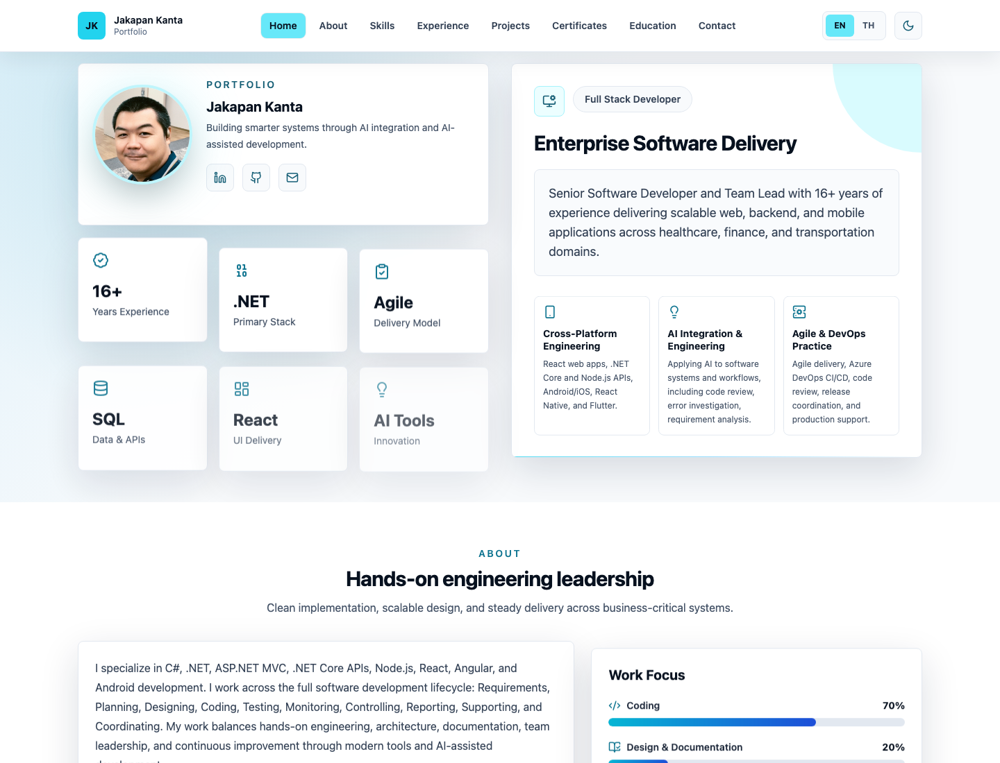
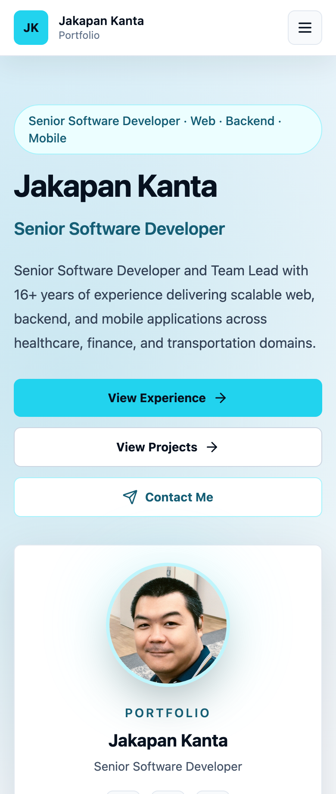
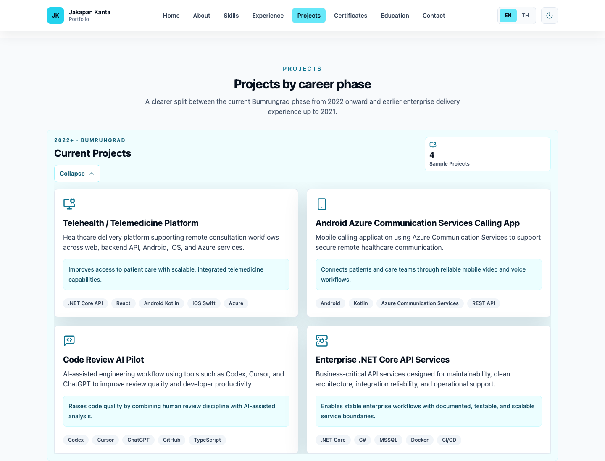
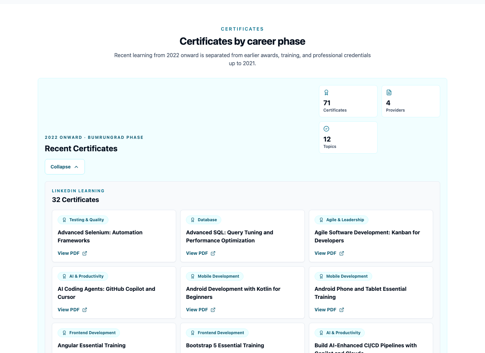
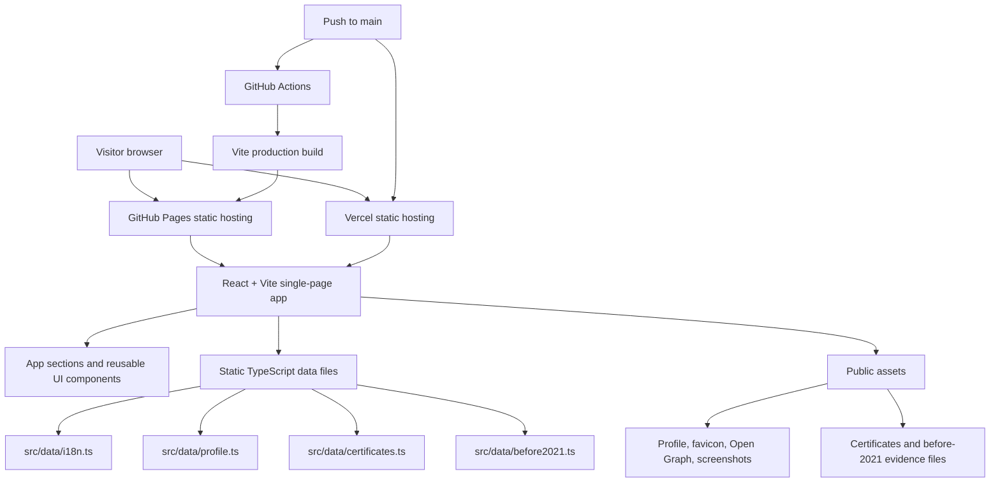

# Project Overview

## Purpose

This project is a professional portfolio website for **Jakapan Kanta**, a Senior Software Developer with 16+ years of experience across web, backend, mobile, healthcare, finance, and transportation systems.

The site is designed for interviewer presentation, resume sharing, professional networking, GitHub Pages hosting, and Vercel Free Hobby hosting.

## Audience

- Hiring managers
- Technical interviewers
- Engineering leaders
- Recruiters
- Professional network contacts

## Design Direction

The UI uses a corporate navy, blue, and cyan visual system with clean card-based sections, responsive layouts, subtle Framer Motion animation, and strong typography. The experience is mobile-first, supports light and dark themes, and keeps navigation clear on desktop and mobile screens.

The current Hero direction emphasizes enterprise delivery, cross-platform engineering, AI integration, AI-assisted development, Agile delivery, and Azure DevOps CI/CD practice.

## Main Sections

1. **Hero**
   - Profile photo
   - Name
   - Portfolio tagline
   - Enterprise software delivery summary
   - Cross-platform engineering, AI integration, and Agile / DevOps value cards

2. **About**
   - Professional overview
   - Work focus ratio
   - Full SDLC coverage: Requirements, Planning, Designing, Coding, Testing, Monitoring, Controlling, Reporting, Supporting, and Coordinating

3. **Skills**
   - Backend
   - Frontend
   - Mobile
   - DevOps and Cloud
   - Database and Reporting
   - Quality and Process
   - UI Frameworks
   - Architecture

4. **Experience Timeline**
   - Bumrungrad International Hospital
   - Honda Leasing Thailand
   - Onelink Technology
   - Key achievements for each role

5. **Projects**
   - Current phase from 2022 onward
   - Earlier phase up to 2021
   - Expandable archive cards for older sample projects
   - Earlier project archive focuses on company, architecture, engineering, source code, and knowledge sharing evidence
   - Separate archive cards for system architecture design and engineering tools evidence
   - Separate archive cards for example source code and team knowledge sharing material
   - Company project evidence uses expanded labels for legacy acronyms such as PTGIS, PVM, and TMS
   - Architecture and engineering tools archive cards keep evidence in link lists without large preview thumbnails
   - Earlier project archive titles, categories, summaries, tags, and key evidence links support English and Thai localization

6. **Certificates**
   - Recent credentials
   - Earlier credentials up to 2021
   - Provider-based certificate grouping
   - Expandable panels for large certificate lists

7. **Education**
   - Master's degree in Information Technology Management with Thai school, degree copy, qualification, transcript, and academic project evidence
   - Bachelor's degree in Information Technology with Thai school, degree copy, qualification, transcript, and academic project evidence

8. **Contact**
   - LinkedIn
   - GitHub
   - Email

## Key Features

- Responsive single-page portfolio
- English / Thai language toggle
- Language toggle uses text labels with tooltips instead of country flags, because the control changes language rather than nationality.
- Education uses slightly tighter top spacing to keep Academic background visually aligned with surrounding sections.
- Education uses a contrasting background from Certificates so the Academic background section has a clear visual boundary.
- Footer uses a contrasting background from Contact to preserve the alternating section rhythm.
- Thai localization covers core UI copy, footer version labels, work focus labels, SDLC lifecycle labels, skill category labels, current project links, education entries, and earlier project archive labels
- Localized cards and repeated lists use stable keys so language switching does not remount visible content unexpectedly.
- Light / Dark theme toggle
- Mobile-friendly header and navigation
- Bottom-of-page active navigation fallback so Contact highlights correctly at the end of the page
- Framer Motion hover and accordion animation
- Hero value cards for cross-platform engineering, AI integration, and Agile / DevOps practice
- Current and archived project evidence, including documents and presentations
- Current and archived certificate evidence
- Open Graph metadata for link sharing
- Vercel Analytics and Speed Insights instrumentation
- Favicon and site icon
- Vite base-path-safe public asset handling for GitHub Pages and Vercel
- MIT License
- Static GitHub Pages and Vercel deployment without backend services

## Visual Assets

Primary visual assets are stored in `public/`:

```text
public/profile.jpg
public/favicon.svg
public/og-image.png
public/resume-qr-jakapank-portfolio.svg
public/resume-qr-jakapank-portfolio.png
public/screenshots/
```

Portfolio QR code assets for resume documents point to the GitHub Pages portfolio URL. Use the SVG for sharp A4 print output and the PNG for broad document editor compatibility.

Generated project screenshots are stored in:

```text
public/screenshots/desktop-home.png
public/screenshots/mobile-home.png
public/screenshots/projects-section.png
public/screenshots/certificates-section.png
```

These images can be used in README documentation, interview presentation material, and repository previews.

## Preview Images

Desktop home:



Mobile home:



Projects section:



Certificates section:



## Technical Notes

- Framework: React with Vite
- Language: TypeScript
- Styling: Tailwind CSS
- Icons: Lucide React
- Animation: Framer Motion
- Analytics: Vercel Analytics and Vercel Speed Insights
- Testing: Vitest with React Testing Library
- Deployment: GitHub Actions to GitHub Pages and Vercel Free Hobby
- Backend: None
- Runtime content source: static TypeScript data files
- License: MIT
- Current project version: `1.1.5`
- Release history: `CHANGELOG.md`
- The current version is displayed in the site footer.

Static data files:

```text
src/data/profile.ts
src/data/i18n.ts
src/data/certificates.ts
src/data/before2021.ts
```

Contributor and AI-agent workflow guidance is stored in:

```text
AGENTS.md
```

Version and release history are stored in:

```text
package.json
CHANGELOG.md
```

Test coverage is intentionally focused on high-value smoke behavior:

- App renders the current Hero messaging
- English / Thai language switching works
- Light / Dark theme switching works
- Mobile expandable panels start collapsed
- Project, certificate, education, demo, and asset links remain wired to the expected targets

## Architecture Diagram


```mermaid
flowchart TD
  visitor[Visitor browser] --> pages[GitHub Pages static hosting]
  visitor --> vercel[Vercel static hosting]
  pages --> app[React + Vite single-page app]
  vercel --> app
  app --> ui[App sections and reusable UI components]
  app --> data[Static TypeScript data files]
  app --> assets[Public assets]
  data --> i18n[src/data/i18n.ts]
  data --> profile[src/data/profile.ts]
  data --> certs[src/data/certificates.ts]
  data --> archive[src/data/before2021.ts]
  assets --> images[Profile, favicon, Open Graph, screenshots]
  assets --> evidence[Certificates and before-2021 evidence files]
  repo[Push to main] --> actions[GitHub Actions]
  actions --> build[Vite production build]
  build --> pages
  repo --> vercel
```

The site is intentionally static: React renders from local TypeScript data and files under `public/`, while GitHub Actions publishes the built `dist` output to GitHub Pages and Vercel can publish the same app from the `main` branch.

## Deployment

The project is configured for the GitHub repository name:

```text
JakapanK-Portfolio
```

Expected deployed URL:

```text
https://ligerking007.github.io/JakapanK-Portfolio/
```

The Vite base path is set to:

```ts
base: process.env.VERCEL === '1' ? '/' : '/JakapanK-Portfolio/'
```

GitHub Pages deployment runs through:

```text
.github/workflows/deploy.yml
```

Vercel deployment uses:

```text
vercel.json
```

Vercel Free Hobby settings:

```text
Framework Preset: Vite
Build Command: npm run build
Output Directory: dist
Node.js Version: 22.x
```

## Maintenance Notes

- Add current certificates under `public/certificates/` and register them in `src/data/certificates.ts`.
- Add earlier project or certificate evidence under `public/before2021/` and register curated items in `src/data/before2021.ts`.
- When adding evidence under `public/before2021/sampleprojects/3-systemarchitecturedesign` or `public/before2021/sampleprojects/4-tools`, register every non-system file in `src/data/before2021.ts`.
- When adding evidence under `public/before2021/sampleprojects/6-sharetoteam`, register every non-system file in the Team Knowledge Sharing archive card.
- Keep filenames URL-safe for GitHub Pages by avoiding spaces, `#`, and special characters.
- Update Open Graph assets when the visual direction changes.
- Keep `index.html` public asset references root-relative, for example `/favicon.svg`, so Vite can apply the GitHub Pages base path without duplicating the path and still build at root for Vercel.
- Use `PROJECT_GENERATION_PROMPT.md` as the reusable prompt when creating a similar portfolio for another person.
- Follow `AGENTS.md` for contributor workflow rules. Every code or content change should update relevant tests and Markdown documentation.
- Update `CHANGELOG.md` and `package.json` when preparing a visible release or notable portfolio update.
- Run `npm run test`, `npm run lint`, and `npm run build` before pushing changes.
