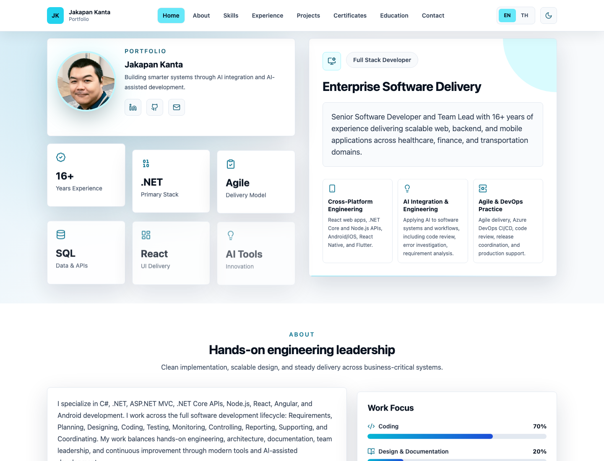
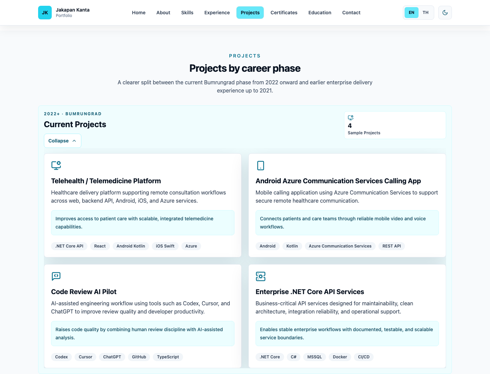
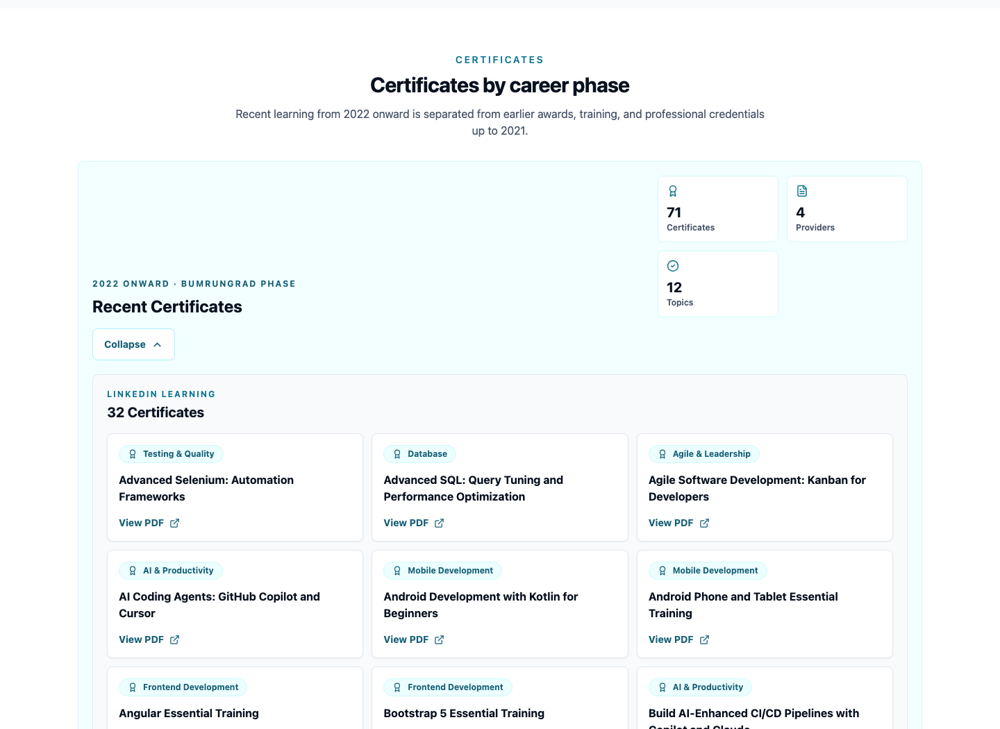

# Jakapan Kanta Portfolio

Professional single-page portfolio website for **Jakapan Kanta**, Senior Software Developer.

Built for GitHub Pages with:

- React
- Vite
- TypeScript
- Tailwind CSS
- Lucide React icons
- English / Thai language toggle
- Light / Dark theme toggle
- AI integration and AI-assisted development messaging
- GitHub Actions deployment

## Live URL

Expected GitHub Pages URL:

```text
https://ligerking007.github.io/JakapanK-Portfolio/
```

The Vite base path is configured in `vite.config.ts`:

```ts
base: '/JakapanK-Portfolio/'
```

If the repository name changes, update this value before deploying.

Public assets such as the favicon, profile photo, certificates, and archived project evidence are resolved through the Vite base path so the same build works locally and on GitHub Pages.

## Screenshots

Desktop home:



Mobile home:


Projects section:



Certificates section:



## Local Setup

Install dependencies:

```bash
nvm use
npm install
```

Run the development server:

```bash
npm run dev
```

Build for production:

```bash
npm run build
```

Run tests:

```bash
npm run test
```

Preview the production build:

```bash
npm run preview
```

## GitHub Pages Deployment

This project includes a GitHub Actions workflow at:

```text
.github/workflows/deploy.yml
```

Deployment steps:

1. Push the repository to GitHub as `JakapanK-Portfolio`.
2. Go to repository **Settings > Pages**.
3. Set **Source** to **GitHub Actions**.
4. Push to the `main` branch.
5. GitHub Actions will build the Vite app and deploy the `dist` artifact.

## Content Updates

Most portfolio content is stored in:

```text
src/data/i18n.ts
src/data/certificates.ts
src/data/before2021.ts
src/data/profile.ts
```

Update this file to adjust:

- English / Thai display copy
- Hero tagline and value cards
- Light / Dark theme behavior in `src/App.tsx` and `src/styles.css`
- Profile summary
- Work focus
- Skills
- Experience timeline
- Projects
- Certificates
- Education
- Contact links

Testing is intentionally lightweight. `src/App.test.tsx` covers smoke-level behavior for rendering, language switching, theme switching, and mobile default collapse behavior.

Contributor and AI-agent workflow rules are documented in:

```text
AGENTS.md
```

When changing code or visible content, update relevant unit tests and Markdown documentation in the same change set.

Certificate PDF files are stored in:

```text
public/certificates/
```

Add new PDF files under the provider folder, then register them in `src/data/certificates.ts`.

Earlier credentials and sample project artifacts are stored in:

```text
public/before2021/
```

Curated archive items are registered in `src/data/before2021.ts` and displayed inside the Projects and Certificates sections as the "Up to 2021" career phase.

Profile and share assets are stored in:

```text
public/profile.jpg
public/favicon.svg
public/og-image.png
public/screenshots/
```

Replace `public/profile.jpg` with the final profile photo when needed.

Browser tab and share assets:

- `public/favicon.svg` is used as the browser tab icon.
- `public/og-image.png` is used for LinkedIn, GitHub, LINE, and other Open Graph previews.
- `index.html` references public assets with root-relative paths so Vite can apply the GitHub Pages base path correctly.

## License

This project is licensed under the MIT License. See [LICENSE](LICENSE) for details.

## Project Structure

```text
.
├── .github/workflows/deploy.yml
├── public/
│   ├── favicon.svg
│   ├── og-image.png
│   ├── og-image.svg
│   ├── profile-avatar.svg
│   ├── profile.jpg
│   ├── before2021/
│   └── certificates/
├── src/
│   ├── data/before2021.ts
│   ├── data/certificates.ts
│   ├── data/i18n.ts
│   ├── data/profile.ts
│   ├── App.tsx
│   ├── main.tsx
│   └── styles.css
├── index.html
├── AGENTS.md
├── tailwind.config.ts
├── vite.config.ts
└── PROJECT_OVERVIEW.md
```
